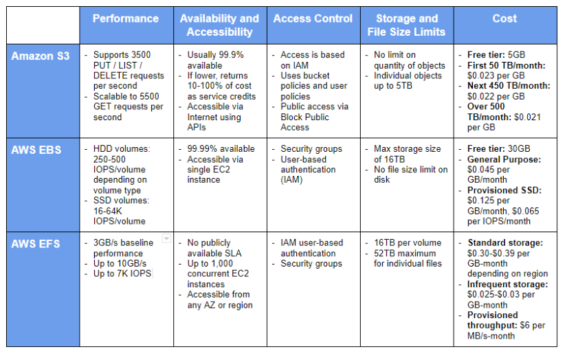

# 🛡️ Vault Raft High Availability Setup on AWS

A Terraform-based setup for deploying a secure, scalable HashiCorp Vault cluster using integrated Raft storage and AWS infrastructure.

---

## 🧩 Solution Overview

This solution leverages Vault's built-in Raft storage for high availability and fault tolerance.

### ✅ Benefits

- Integrated directly into Vault, reducing external dependencies
- All configuration handled within Vault
- Supports automatic failover and multi-cluster replication
- Eliminates the need for additional networked storage requests
- Simplifies troubleshooting and speeds up recovery time

.

---

## 🚀 Installation Guide

### 1. Clone the Repository

```bash
git clone https://github.com/hashicorp-education/learn-vault-raft.git
cd learn-vault-raft/raft-storage/aws
- ----- Create key name on aws key_name
Terraform init 
Terraform plan
Terraform apply 
```


# 🔐 Vault Auto-Unseal with Transit & Raft Leadership

This setup demonstrates how to configure a Vault cluster using Raft integrated storage with a delegated **auto-unseal** mechanism via the **Transit Secrets Engine**.

---

## 🧭 Cluster Architecture Overview

We will use `vault-0` as a **Transit Vault** to manage auto-unsealing of Raft cluster nodes. This replaces the traditional manual Shamir key unseal process.

### 🔧 Node Roles

- **vault_0**:
  - Acts as the **Transit Vault**
  - Hosts the Transit secrets engine used for encryption/decryption of Raft master keys
  - Not a member of the Raft cluster

- **vault_1**:
  - Initialized and unsealed
  - Uses root token to create a **transit key**
  - Enables auto-unseal for other Vault nodes
  - Does **not join** the Raft cluster

- **vault_2**:
  - Initialized and unsealed
  - Becomes the **Raft cluster leader**
  - Stores a sample **K/V-V2 secret**

- **vault_3** and **vault_4**:
  - Started but not initialized
  - You will **manually join** them to the Raft cluster

---

## ⚙️ Raft Leadership & Cluster Join Process

### 🛠️ How Joining Works

Once the cluster has a leader, additional servers can join using an **encrypted challenge/answer** workflow. For a successful join:

- All nodes **must share the same seal configuration**
- If auto-unseal is enabled:
  - Vault automatically decrypts the challenge using the configured seal
  - Responds with the correct answer to join the cluster

---

## 🧠 Raft Roles Explained

### 🏆 Leader Node

- Handles:
  - Write operations
  - Token generation
  - Unseal operations
- Manages:
  - Log replication to followers
  - Raft consensus & cluster coordination

### 🔁 Follower Nodes

- Start as followers by default
- Responsibilities:
  - Accept and store replicated logs from leader
  - Vote in leader elections
  - Mirror the cluster data
  - Serve **read-only** traffic (if enabled)
  - **Automatically elect a new leader** if the current one fails

---

## 🚨 Leader Failure Scenario

If the leader fails:

1. Remaining voter nodes **detect the failure**
2. A **new leader is automatically elected**
3. Cluster continues operations without manual intervention

---

## 📡 How Does the NLB Detect the Active Leader?

To determine the status of a Vault node, you can query the health endpoint:

```bash
curl http://<vault-ip>:8200/v1/sys/health
```


## Automatic snapshots with integrated storage
Vault's built-in automated snapshot mechanism

.

Recommendation:
✅ Use EBS Snapshots for automated, consistent, and fast backups of Vault's Raft storage (since data is on local disk).
✅ Frequency: Every 30 minutes to 1 hour depending on how critical your data is.
✅ Retention: At least 1 day’s worth (48 snapshots if hourly), or longer based on policy.
Snapshot All Nodes


photo-5


## 📚 References

- [Integrated storage configuration | Vault | HashiCorp Developer](https://developer.hashicorp.com/vault/docs/configuration/storage/integrated)
- [Best Practices - AWS NLB configuration for Vault – HashiCorp Help Center](https://support.hashicorp.com/hc/en-us/articles/360049198072-Best-Practices-AWS-NLB-configuration-for-Vault)
- [🎥 Vault Raft & Auto-Unseal Explained (YouTube)](https://youtu.be/scxqbgzs5hs)
- [Confused by AWS Storage Options? S3, EBS, EFS Explained](https://www.youtube.com/watch?v=scxqbgzs5hs) *(Same video as above, but you can rename or keep both)*
- [Ensuring High Availability in HashiCorp Vault Using the Integrated Storage (Raft) Backend | Medium](https://medium.com/@rakshantha/ensuring-high-availability-in-hashicorp-vault-using-the-integrated-storage-raft-backend-3cf2c44e9c8e)


# 💾 Automating Vault Raft Snapshots

This guide outlines how to automate periodic snapshots of a Vault Raft cluster using the Vault CLI and a shell script.

---

## 🛠️ Script: `vault_snapshot.sh`

Create a snapshot backup script at `/opt/vault/scripts/vault_snapshot.sh`:

```bash
#!/bin/bash

# === CONFIGURATION ===
VAULT_ADDR="http://127.0.0.1:8200"                # Replace with your Vault address
VAULT_TOKEN="your-root-or-backup-token"           # Use a token with snapshot capability (preferably read-only)
SNAPSHOT_DIR="/opt/vault/snapshots"
TIMESTAMP=$(date +"%Y%m%d_%H%M%S")
SNAPSHOT_FILE="$SNAPSHOT_DIR/vault-snapshot-$TIMESTAMP.snap"

# === Ensure snapshot directory exists ===
mkdir -p "$SNAPSHOT_DIR"

# === Export env vars for Vault CLI ===
export VAULT_ADDR
export VAULT_TOKEN

# === Create snapshot ===
vault operator raft snapshot save "$SNAPSHOT_FILE"

# === Log outcome ===
if [ $? -eq 0 ]; then
    echo "[$(date)] Snapshot saved: $SNAPSHOT_FILE" >> /var/log/vault_snapshot.log
else
    echo "[$(date)] Snapshot FAILED!" >> /var/log/vault_snapshot.log
fi

# === Optional: Remove snapshots older than 7 days ===
find "$SNAPSHOT_DIR" -type f -name "*.snap" -mtime +7 -exec rm {} \;
```

Automate with Cron
To schedule the snapshot daily at 2:00 AM, edit the root crontab:

bash
Copy
Edit
crontab -e
Add the following line:

bash
Copy
Edit
0 2 * * * /bin/bash /opt/vault/scripts/vault_snapshot.sh
This will:

Create a new Raft snapshot every day at 2:00 AM

Log the result to /var/log/vault_snapshot.log

Clean up snapshots older than 7 days from /opt/vault/snapshots
